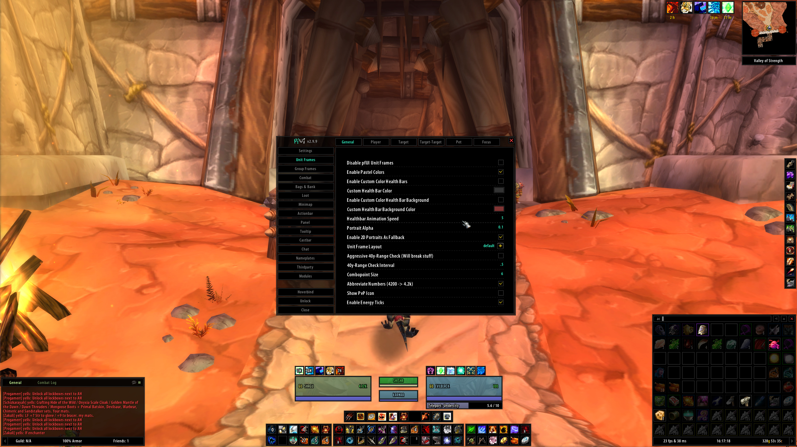
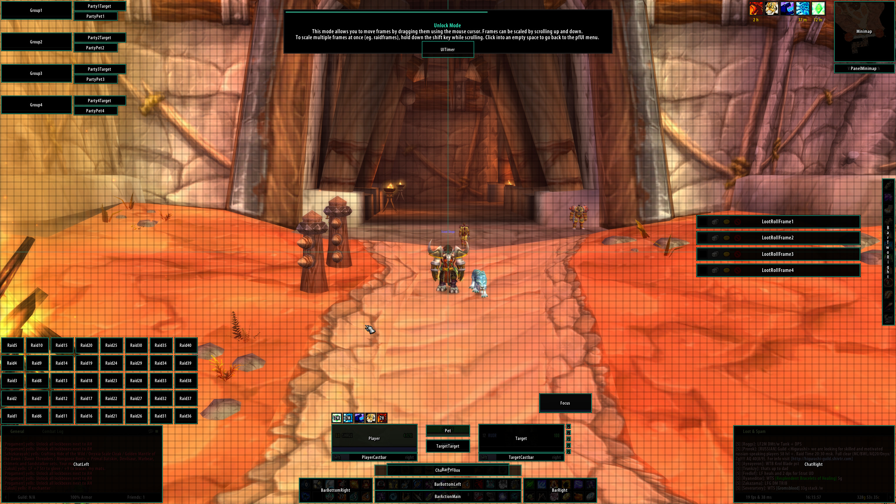
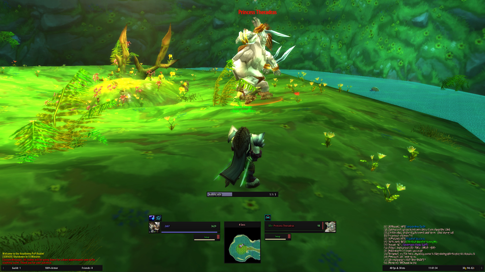

  

# pfUI Epoch

A complete user interface replacement for Project Epoch, based on Shagu's
pfUI for Turtle WoW and ported and extended for Epoch by Fragglechen.

This port keeps pfUI's minimalistic style while adapting Blizzard frames,
Epoch-specific features, and supported third-party addons to the 3.3.5-based
Epoch client.

## Special Thanks

A very special thanks to [Shagu](https://shagu.org), the original author of
pfUI. This Epoch port would not exist without his years of work, thoughtful
design, and the strong foundation he created for the WoW community.

**Please do not re-upload or distribute outdated versions of this project. However, you are more than welcome to fork or link to the official github page.**

## Screenshots

## Installation

### Easy mode (recommended)

Use [EpochAddonUpdater](https://github.com/Fragglechen/EpochAddonUpdater).  
Or any tool that supports Git-based addon updates.

### Manual

1. [Download pfUI Epoch](https://github.com/Fragglechen/pfui-epoch).
2. Extract the zip file.
3. Ensure the resulting folder is named `pfui-epoch`.
4. Move that folder to `[Path\To\WoW]\Interface\AddOns`.
5. Ensure the structure is `Interface\AddOns\pfui-epoch\pfui-epoch.toc`.
   *These are all **wrong**:*
   x `pfui-epoch\pfui-epoch\pfui-epoch.toc`
   x `pfui-epoch-main\pfui-epoch.toc`
   x `pfui-epoch\pfui-epoch-main\pfui-epoch.toc`
   

## Commands

    /pfui         Open the configuration GUI
    /share        Open the configuration import/export dialog
    /gm           Open the ticket Dialog
    /rl           Reload the whole UI
    /farm         Toggles the Farm-Mode
    /pfcast       Same as /cast but for mouseover units
    /focus        Creates a Focus-Frame for the current target
    /castfocus    Same as /cast but for focus frame
    /clearfocus   Clears the Focus-Frame
    /swapfocus    Toggle Focus and Target-Frame
    /abp          Addon Button Panel

## Languages
pfUI supports and contains language specific code for the following gameclients.
* English (enUS)
* Korean (koKR)
* French (frFR)
* German (deDE)
* Chinese (zhCN)
* Spanish (esES)
* Russian (ruRU)

## Recommended Addons
* [pfQuest](https://shagu.org/pfQuest) + for Epoch: https://github.com/Bennylavaa/pfQuest-epoch | A simple database and quest helper
* [WIM] https://www.wowinterface.com/downloads/fileinfo.php?id=5342&so=DESC&page=2 | Give whispers an instant messenger feel

## Plugins
* [pfUI-eliteoverlay](https://shagu.org/pfUI-eliteoverlay) Add elite dragons to unitframes
* [pfUI-fonts](https://shagu.org/pfUI-fonts) Additional fonts for pfUI
* [pfUI-CustomMedia](https://github.com/mrrosh/pfUI-CustomMedia) Additional textures for pfUI
* [pfUI-Gryphons](https://github.com/mrrosh/pfUI-Gryphons) Add back the gryphons to your actionbars

## FAQ
**What does "pfUI" stand for?**  
The term "*pfui!*" is german and simply stands for "*pooh!*", because I'm not a
big fan of creating configuration UI's, especially not via the Wow-API
(you might have noticed that in ShaguUI).

**How can I donate?**  
You can donate via

**How do I report a Bug?**  
Please provide as much information as possible in the [Bugtracker](https://github.com/Fragglechen/pfUI-epoch/issues).
If there is an error message, provide the full content of it. Just telling that "there is an error" won't help any of us.
Please consider adding additional information such as: since when did you got the error,
does it still happen using a clean configuration, what other addons are loaded and which version you're running.
When playing with a non-english client, the language might be relevant too. If possible, explain how people can reproduce the issue.

**How can I contribute?**  
Report Errors, Issues and Feature Requests in the [Bugtracker](https://github.com/Fragglechen/pfUI-epoch/issues).
Please make sure to have the latest version installed and check for conflicting addons beforehand.

**I have bad performance, what can I do?**  
There's only one known performance issue: that is while using "Frame Shadows". Make sure to disable those
in the pfUI settings (Settings -> Appearance -> Enable Frame Shadows). If you still have a low performance,
it's most likely a combination with another addon. Disable all AddOns but pfUI and then enable one-by-one,
till the performance problem occurs again. Make sure to report the identified AddOn and what you did to reproduce
via the [Bugtracker](https://github.com/Fragglechen/pfUI-epoch/issues).

**Where is the happiness indicator for pets?**  
The pet happiness is shown as the color of your pet's frame. Depending on your skin, this can either be the text or the background color of your pet's healthbar:

- Green = Happy
- Yellow = Content
- Red = Unhappy

**Can I use Clique with pfUI?**  
This addon already includes support for clickcasting. If you still want to make use of clique, all pfUI's unitframes are already compatible to Clique-TBC. If you want to keep your current version of Clique, you'll have to apply this [Epoch] https://gitlab.com/Tsoukie/clique-3.3.5

**Where is the Experience Bar?**  
The experience bar shows up on mouseover and whenever you gain experience, next to left chatframe by default. There's also an option to make it stay visible all the time.

**How do I show the Damage- and Threatmeter Dock?**  
If you enabled the "dock"-feature for your external (third-party) meters such as DPSMate or KTM, then you'll be able to toggle between them and the Right Chat by clicking on the ">" symbol on the bottom-right panel.

**Why is my chat always resetting to only 3 lines of text?**  
You need to disable the "Simple Chat" in blizzards interface settings (Advanced Options). Then relog and reset/run the firstrun wizard again.

**How can I enable mouseover cast?**  
On Vanilla, create a macro with "/pfcast SPELLNAME". If you also want to see the cooldown, You might want to add "/run if nil then CastSpellByName("SPELLNAME") end" on top of the macro. For The Burning Crusade, just use the regular mouseover macros.

**Will there be pfUI for Activision's "Classic" remakes?**  
No, it would require an entire rewrite of the AddOn since the game is now a different one. The AddOn-API has evolved during the last 15 years and the new "Classic" versions are based on a current retail gameclient. I don't plan to play any of those new versions, so I won't be porting any of my addons to it.

**Everything from scratch?! Are you insane?**  
Most probably, yes.
